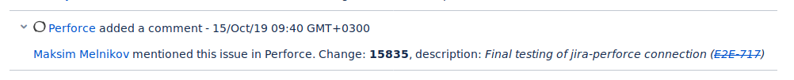

# Simple Perforce<->Jira Connection

Simply connect your Jira issue and Perforce changelist with issue-key in comment.

## Requirements

* Perforce user to discover submits (security note: readonly permission is good practice)
* Jira user to leave comments in issues (security note: give him only `View projects` and `Create comments` permission)
* Python3
* `requirements.txt`

## Installation

1. Install requirements.
2. Create `.env` environment file with Jira credentials:
```
JIRA_URL='<>'
JIRA_USER='<>'
JIRA_PASSWORD='<>'
```
3. Change `WORKING_PATH`, `P4USER`, `P4PASSWD` with  your values.
4. Add `change-trigger` trigger to your p4 triggers (`p4 triggers`):
```
p4-jira change-commit //depot/... "/opt/perforce/p4-jira/p4-jira.py %changelist% %user%"
```
5. Profit:

